# gitflow4code
## gitflow-avh implementation for Visual Studio Code
This extension adds support for the feature branching strategy described here in [Vincent Driessen's branching model](http://nvie.com/posts/a-successful-git-branching-model/). The implementation used by this extension is similar to the functionality offered by [git-flow (AVH Edition)](https://github.com/petervanderdoes/gitflow-avh).

### What's included
* Initialize a repository with default or custom values for branch naming (i.e. 'develop', 'master', 'feature/', etc)
* Start/Finish Feature branches from "development", or from other branch bases
* Start/Finish Release branches from "development", or from other branch bases
* Start/Finish Hotfix branches from "production", or from other branch bases
* Get the status of a git repository

#### Dependencies
* git (if you have installed VS Code, this should also already exist on your machine)

# Getting Started
## Accessing gitflow4code commands
From the Command Pallette, type in GitFlow and choose the GitFlow: Run GitFlow commands option


Alternately, you can use the shortcut keys listed below to display the gitflow4code commands
##### Shortcuts to Available Commands 
* ⌥⌘/ on Mac
* Ctrl+Alt+/ on Windows


## Initialize
Choose the Initialize Repository command from the list of available gitflow4code commands.


### Initialize with default settings
Choose to `Initialize with default` (i.e. `master`, `develop`, `feature/`, `release/`, & `hotfix/`)
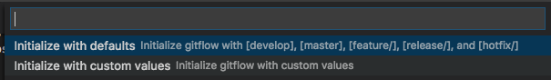

### Initialize with custom configuration settings
Choose to `Initialize with custom values` and then specify the values requested
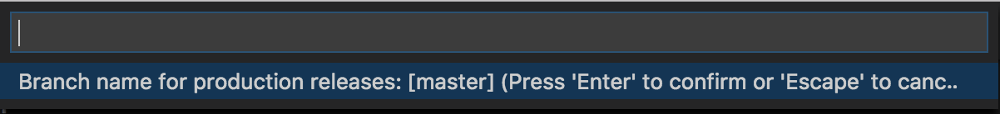
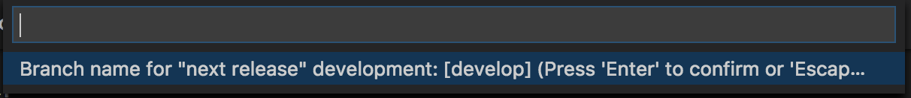
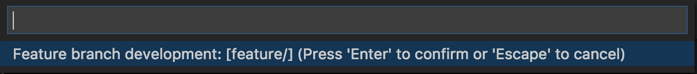
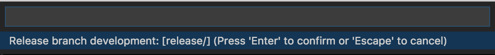
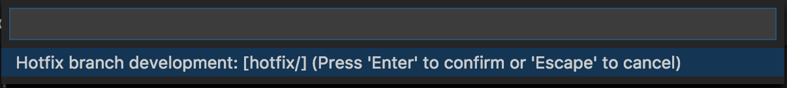

These settings are stored and can be edited at any time by re-running the above commands or by editing in the Settings file.
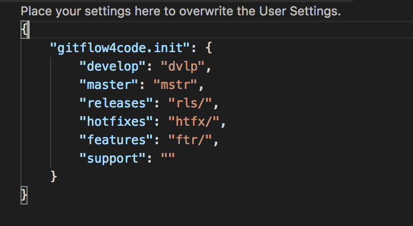


## Features
### Start Feature
Choose the `Features` command from the list of available gitflow4code commands
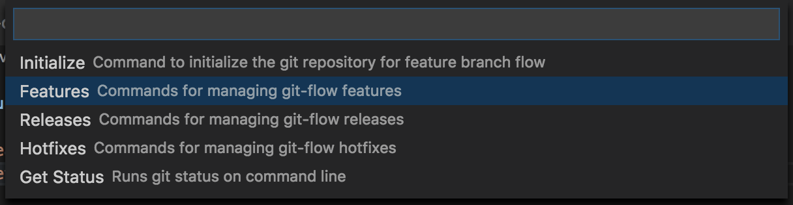

If creating a feature branch off of your development branch, choose `Start Feature from <develop>` (where `develop` is the name of whatever you chose to initialize your development branch) 
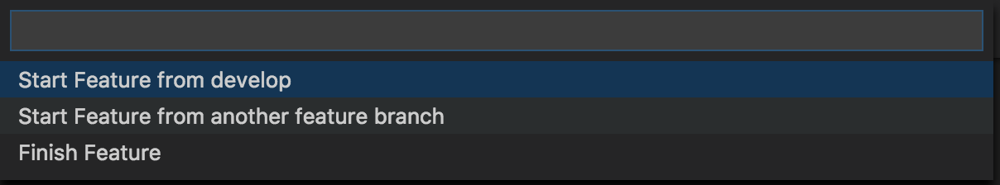

 -- or --

If creating a feature branch off another base branch, choose `Start Feature from branch`
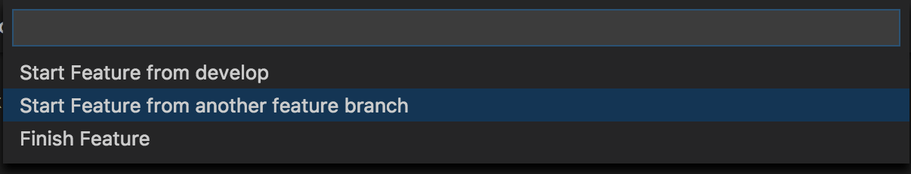


Then supply the name of your feature branch, and the tool will prefix it with whatever you chose to be the name of your feature branches
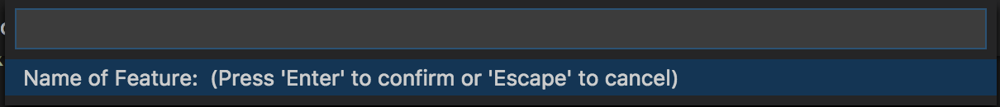

### Finish Feature
When finished with your feature, choose the `Features` command from the list of available gitflow4code commands and then choose to `Finish Feature` 
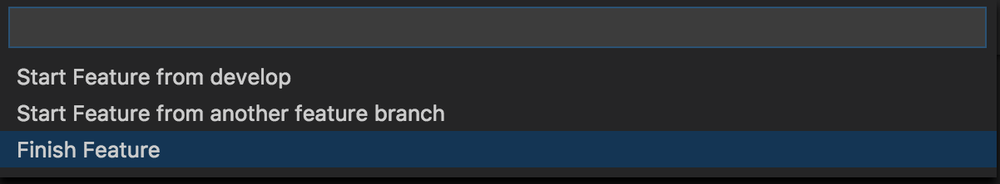

## Releases
### Start Release
Choose the `Releases` command from the list of available gitflow4code commands
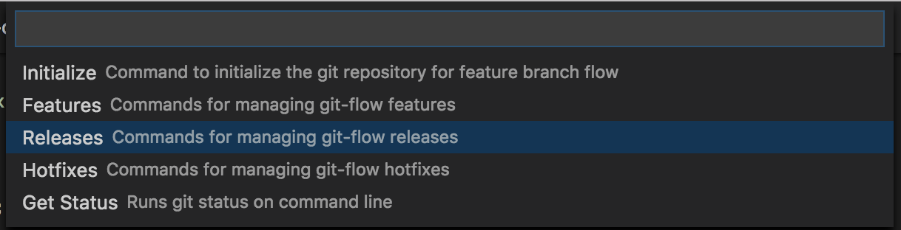

If creating a release branch off of your development branch, choose `Start Release from <develop>` (where `develop` is the name of whatever you chose to initialize your development branch) 
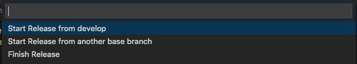

 -- or --

If creating a release branch off another base branch, choose `Start Release from another branch`


Then supply the name of your release branch, and the tool will prefix it with whatever you chose to be the name of your release branches
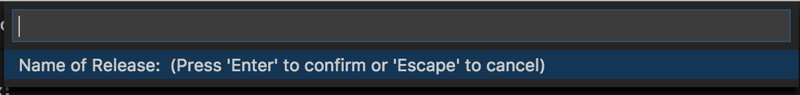

### Finish Release
When finished with your release, choose the `Releases` command from the list of available gitflow4code commands and then choose to `Finish Release` 
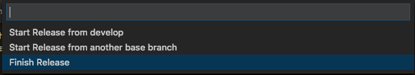

Then supply the name of the `Tag` for this release


## Hotfixes
### Start Hotfix
Choose the `Hotfixes` command from the list of available gitflow4code commands
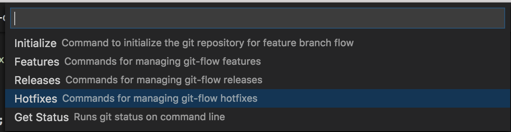

If creating a hotfix branch off of your production branch, choose `Start Hotfix from <master>` (where `master` is the name of whatever you chose to initialize your production branch) 
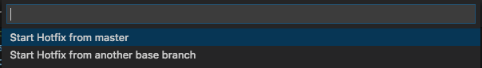

 -- or --

If creating a hotfix branch off another base branch, choose `Start Hotfix from another branch`
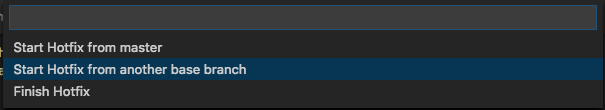

Then supply the name of your hotfix branch, and the tool will prefix it with whatever you chose to be the name of your hotfix branches
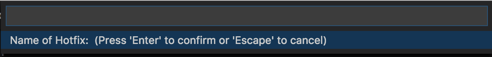

### Finish Hotfix
When finished with your hotfix, choose the `Hotfixes` command from the list of available gitflow4code commands and then choose to `Finish Hotfix` 
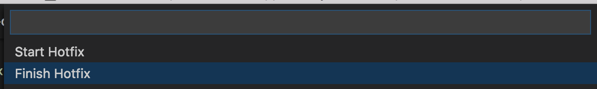

Then supply the name of the `Tag` for this hotfix
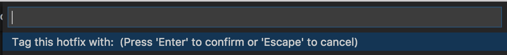


## Git Status
Choosing this from the gitflow4code commands list will display the current status of the local git repository (same as if running `git status` on the command line) and displays it in the `OUTPUT` pane
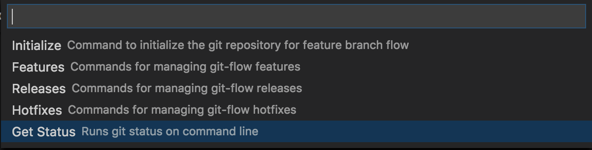
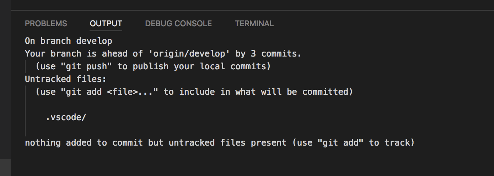


# Extra
## gitflow4code roadmap
* Redesign command menu
* Add shortcut functionality to finish current feature/release/hotfix via a status bar button
* Ability to configure whether or not local branches and/or remote tracking branches are deleted after finishing

## Help Out?
This project is under constant development. Feedback and suggestions are very welcome and I encourage you to use the [Issues](https://github.com/Shaggy13spe/gitflow4code/issues) list on Github to provide that feedback.

### Contributing
Fork the repository and then run:
```sh
$ git clone -b master git@github.com:<username>/gitflow4code.git
cd gitflow4code
```

The `-b master` switch has to be added since the fork operation automatically clones the `develop` branch of the repository and cloning it results in a local repository with just a `develop` branch.

After that, initialize the local gitflow4code repository with `gitflow4code` itself (see Getting Started above).
Then create a feature branch, do your work and commit your changes publishing your feature branch.

When done, open a pull request to your feature branch.


