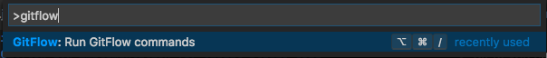
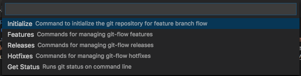

# gitflow4code
## Gitflow-avh implementation for Visual Studio Code
This extension adds support for the feature branching strategy described here in [Vincent Driessen's branching model](http://nvie.com/posts/a-successful-git-branching-model/). The implementation used by this extension is similar to the functionality offered by by [git-flow (AVH Edition)](https://github.com/petervanderdoes/gitflow-avh).

### What's included
* Initialize a repository with default or custom values for branch naming (i.e. 'develop', 'master', 'feature/', etc)
* Start/Finish Feature branches from develop, or from other feature branch bases
* Start/Finish Release branches
* Start/Finish Hotfix branches
* Get the status of a git repository

#### Dependencies
* git (if you have installed VS Code, this should also already exist on your machine)

# Getting Started
Choose the Initialize Repository command from the list of available gitflow4code commands.



##### Shortcuts to Available Commands 
* ⌥⌘/ on Mac
* Ctrl+Alt+/ on Windows

Choose to either Initialize with default settings or customize your branching names



## gitflow4code roadmap
* Redesign command menu

## Help Out?
This project is under constant development. Feedback and suggestions are very welcome and I encourage you to use the [Issues](https://github.com/Shaggy13spe/gitflow4code/issues) list on Github to provide that feedback.

### Contributing
Fork the repository and then run:
```sh
$ git clone -b master git@github.com:<username>/gitflow4code.git
cd gitflow4code
```

The `-b master` switch has to be added since the fork operation automatically clones the `develop` branch of the repository and cloning it results in a local repository with just a `develop` branch.

After that, initialize the local gitflow4code repository with `gitflow4code` itself (see Getting Started above).
Then create a feature branch, do your work and commit your changes publishing your feature branch.

When done, open a pull request to your feature branch.


